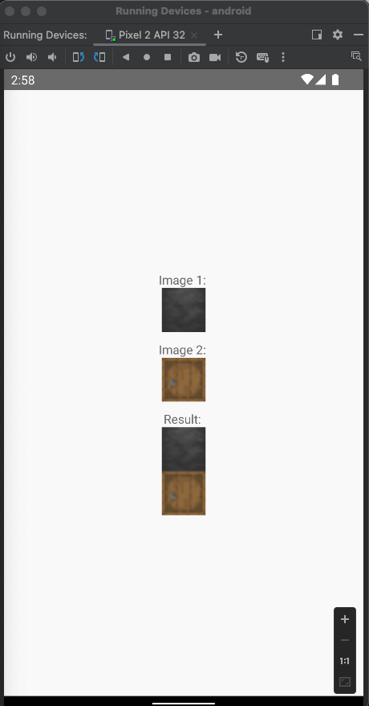
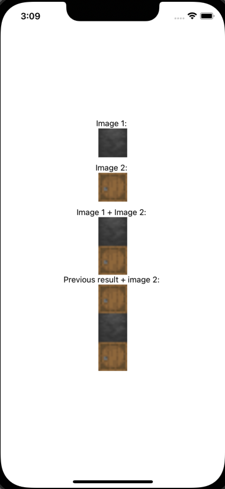

# react-native-merge-images-vertically

This straightforward library for React Native enables vertical image merging, inspired by [react-native-images-merge](https://github.com/cristea2017/react-native-images-merge). Unlike the original, this library allows for merging images regardless of their size, meaning it is not limited to square images only.
### Android Example


### iOS Example


## Installation

```sh
npm install react-native-merge-images-vertically
```

```sh
cd ios 
pod install
```

## Usage

```js
import { mergeImages } from 'react-native-merge-images-vertically';

// ...

const result = await mergeImages(['image1Base64', 'image2Base64']);
```

## Contributing

See the [contributing guide](CONTRIBUTING.md) to learn how to contribute to the repository and the development workflow.

## License

MIT

---

Made with [create-react-native-library](https://github.com/callstack/react-native-builder-bob)
